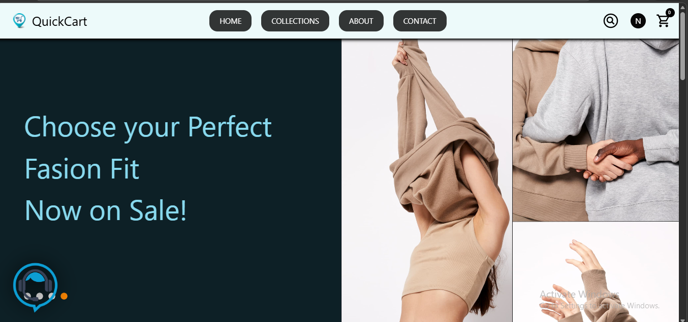
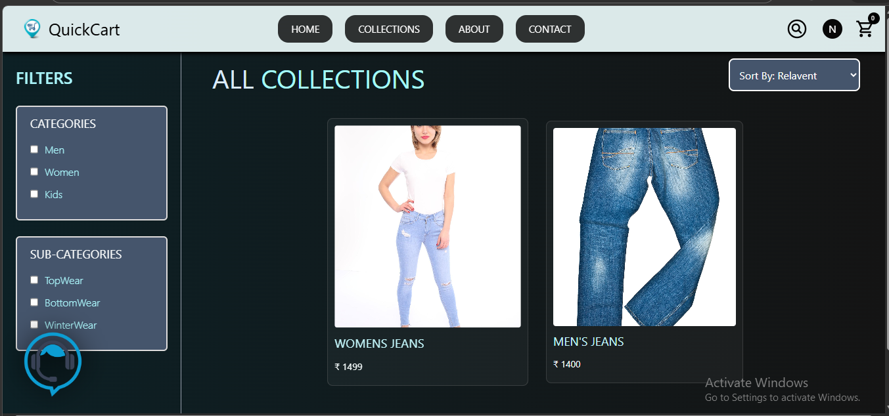
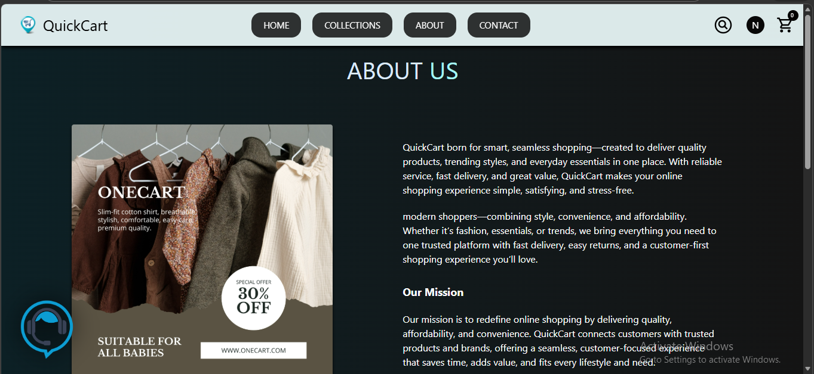
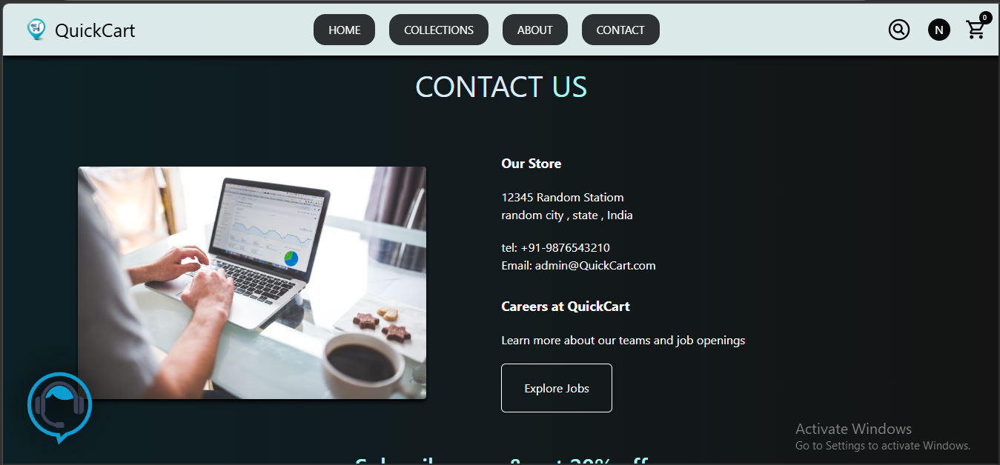

# QuickCart – MERN E-commerce Platform

QuickCart is a full-stack e-commerce web application built using the **MERN stack (MongoDB, Express, React, Node.js)**.
The platform allows users to browse products, filter collections, add items to the cart, and place orders, while administrators can manage products and orders through a dedicated admin dashboard.

---

##  Features

* User authentication (Login / Register)
* Product listing and filtering
* Category and subcategory filters
* Search functionality
* Shopping cart system
* Order placement
* Admin dashboard for product management
* Image upload using Cloudinary
* Secure backend using JWT authentication

---

##  Tech Stack

**Frontend**

* React.js
* Vite
* Tailwind CSS

**Backend**

* Node.js
* Express.js

**Database**

* MongoDB Atlas

**Other Tools**

* Cloudinary (image hosting)
* Razorpay (payment integration)
* Axios

---

##  Project Structure

```
QuickCart
│
├── admin        # Admin Dashboard (React)
├── backend      # Node.js / Express API
├── frontend     # User E-commerce Website
│
├── README.md
└── .gitignore
```

---

##  Installation

Clone the repository:

```bash
git clone https://github.com/Neha29-aiml/quickcart-mern-ecommerce.git
cd quickcart-mern-ecommerce
```

Install dependencies:

```bash
cd backend
npm install

cd ../frontend
npm install

cd ../admin
npm install
```

Run the project:

```bash
backend → nodemon index.js
frontend → npm run dev
admin → npm run dev
```

---

##  Screenshots

### Home Page



### Collections Page



### About Page



### Contact Page




